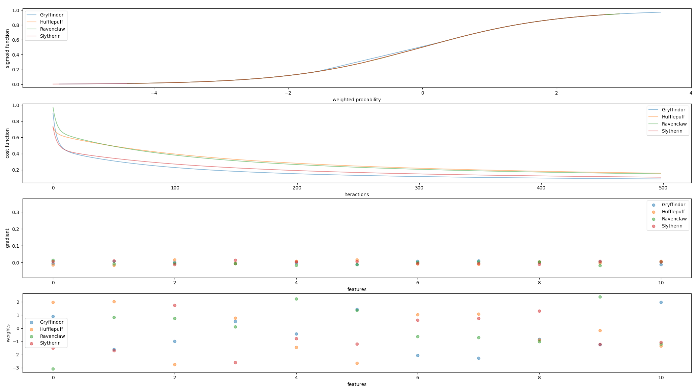

<p align="center">
	&nbsp;&nbsp;&nbsp;
	<h1 align="center">dslr</h1>
</p>
<p align="center">
	<!--img src="https://img.shields.io/badge/Success-125/100_✓-gray.svg?colorA=61c265&colorB=4CAF50&style=for-the-badge"-->
	
	
</p>

<p align="center">
	<b><i>Development repository for the 42cursus dslr project @ 42 Heilbronn</i></b><br>
	<b><i>Team project: @iwillens and @ttokesi</i></b><br>
</p>

<p align="center">
	
	
	
	
</p>
<br>

> _In this project DataScience x Logistic Regression, you will continue your exploration of Machine Learning by discovering different tools._

>_You will implement a linear classification model, as a continuation of the subject linear regression : a logistic regression._

<br>

<p align="center">
	<table>
		<tr>
			<td><b>Est. Time</b></td>
			<td><b>Skills</b></td>
			<td><b>Difficulty</b></td>
		</tr>
		<tr>
			<td valign="top">98 hours</td>
			<td valign="top">


			</td>
			<td valign="top"> 6000 XP</td>
		</tr>
	</table>
</p>


<br>

# 1. Data Analysis:
_We will see some basic steps of data exploration. Of course, these are not the only techniques available or the only one step to follow. Each data set and problem has to be approached in an unique way._

```python3
$ python3 describe.py datasets/dataset_train.csv

          Arithmancy    Astronomy  ...       Charms       Flying
Count    1566.000000  1568.000000  ...  1600.000000  1600.000000
Mean    49634.570243    39.797131  ...  -243.374409    21.958013
Std     16679.806036   520.298268  ...     8.783640    97.631602
Min    -24370.000000  -966.740546  ...  -261.048920  -181.470000
25%     38511.500000  -489.551387  ...  -250.652600   -41.870000
50%     49013.500000   260.289446  ...  -244.867765    -2.515000
75%     60811.250000   524.771949  ...  -232.552305    50.560000
Max    104956.000000  1016.211940  ...  -225.428140   279.070000
Nan        34.000000    32.000000  ...     0.000000     0.000000

[9 rows x 13 columns]
```


# 2. Data Visualization

## 2.1 histogram

_Which Hogwarts course has a homogeneous score distribution between all four houses?_

```python3
$ python3 histogram.py
```


Using histogram, we can visualize that `Care of Magical Creatures` has the most homogeneous distributions, alongside with `Arithmancy`, `Best Hand` and `Birthday`

These distributions can be seen side by side on pair_plot.


## 2.2 scatterplot

_What are the two features that are similar?_

```python3
$ python3 scatter_plot.py
```


Using scatterplot, we can visualize related features.

`Astronomy` and `Defense Against the Dark Arts` seem to have a nearly perfect inverse correlation.


## 2.3 scatterplot

_From this visualization, what features are you going to use for your logistic regression_

```python3
$ python3 pair_plot.py
```


The selected features are the ones with the least homogeneous distribution:
`Astronomy, Herbology, Defense Against the Dark Arts, Divination, Muggle Studies, Ancient Runes, History of Magic, Transfiguration, Potions, Charms, Flying`

Therefore, `Best Hand, Birthday, Care of Magical Creatures and Astronomy` won't be considered during training and prediction.


# 3. Logistic Regression


## Training the model:

The model is trained by running `python3 logreg_train.py`, with the training dataset as first argument.
```python3
$ python3 logreg_train.py datasets/dataset_train.csv
Training for class: Gryffindor
Training for class: Hufflepuff
Training for class: Ravenclaw
Training for class: Slytherin
Weights: {'Gryffindor': array([ 0.03041143, -0.06922508,  0.91211839, -1.59900825, -0.98830852,
        0.52897752, -0.4336095 ,  1.45404033, -2.05020486, -2.25922207,
       -0.82116218, -1.25122702,  1.97887483]), 'Hufflepuff': array([-0.11939421, -0.28423178,  2.02367982,  2.05209885, -2.70640668,
        0.82254406, -1.43653494, -2.61390926,  1.0677205 ,  1.1066557 ,
       -0.85584552, -0.16509698, -1.30050343]), 'Ravenclaw': array([-0.27704816, -0.43824755, -2.92207501,  0.86278718,  0.86809872,
        0.21055969,  2.26045173,  1.4351762 , -0.51042303, -0.58434894,
       -0.87901462,  2.393354  , -1.0521832 ]), 'Slytherin': array([ 0.1190807 ,  0.05652709, -1.50870683, -1.70949972,  1.74840806,
       -2.59887872, -0.78662808, -1.19987057,  0.60232151,  0.73479555,
        1.31072843, -1.21350769, -1.07177567])}
Biases: {'Gryffindor': array([0.53204114]), 'Hufflepuff': array([-0.52298734]), 'Ravenclaw': array([-1.64130841]), 'Slytherin': array([0.39767889])}
```

this will generate a file called `model.json`, containing the weights and biases

### Gradient Descent Visualization:




## Predicting:

To use the model to make predictions, you must run the command `python3 logreg_predict.py` passing the dataset to be predicted and the model file as arguments.
```python3
$ python3 logreg_predict.py datasets/dataset_test.csv model.json
    Hogwarts House
0       Hufflepuff
1        Ravenclaw
2       Gryffindor
3       Hufflepuff
4       Hufflepuff
..             ...
395      Slytherin
396     Hufflepuff
397     Hufflepuff
398      Ravenclaw
399      Ravenclaw

[400 rows x 1 columns]
```

this will generate a file called `houses.csv`, with the resulting predicted values


## Logistic Regression Class

This class provides methods for training a logistic regression model, making predictions, and evaluating the model's performance.

The class supports multiclass classification by training separate models for each class, as indicated by the "one-vs-all" approach.

### Class Initialization

You can create an instance of the `LogisticRegression` class by providing optional parameters for configuring the model. Here are the available parameters:

- `verbose` (bool, optional): If set to `True`, the class will display log messages during the training process. Defaults to `False.

- `fit_intercept` (bool, optional): If set to `True`, the class will calculate biases during training. If set to `False`, no biases will be calculated. Defaults to `True`.

### Methods

#### 1. `fit(X, y, normalize=True, delta_threshold=1e-7, max_iterations=500, learning_rate=0.15, save_history=False)`

- `X` (numpy.ndarray): The input data, where each row represents a sample, and each column represents a feature.

- `y` (numpy.ndarray): The true label values corresponding to the input data.

- `normalize` : If set to `True`, normalizes X using minmax.

- `delta_threshold` (float, optional): The threshold for early stopping during training. If the change in the cost function is smaller than this threshold, training stops. Defaults to 1e-7.

- `max_iterations` (int, optional): The maximum number of training iterations.

- `learning_rate` (float, optional): The learning rate for gradient descent. 

- `save_history` (bool, optional): If set to `True`, training history will be saved along with the model weights.

#### 2. `save_model(filename='model.json')`

This method saves the trained model's weights, biases, classes, and other information to a JSON file. You can specify the filename as an optional parameter.

#### 3. `load_model(filename='model.json')`

This method loads a previously trained model from a JSON file. You can specify the filename of the model to be loaded as an optional parameter.

#### 4. `score(X, y, normalize=True)`

This method calculates the accuracy of the model by comparing its predictions on the input data `X` with the true labels `y`. It returns the accuracy score.

#### 5. `predict(X, normalize=True, save=True, filename='predictions.csv', labelname='Predictions')`

This method uses the trained model to make predictions on the input data `X`. You can specify whether to normalize the input data, whether to save the predictions to a CSV file, the filename for the CSV file, and the label name for the predictions.

#### 6. `graph()`

This method creates a graphical display of the training process, showing the sigmoid function, cost function, gradients, and weights over training iterations. Note that the training history must be saved during training for this method to work, using fit(X, y, save_history=True).


### Example Usage

Here's an example of how to use the `LogisticRegression` class:

```python
# Create an instance of the LogisticRegression class
model = LogisticRegression(verbose=True)

# Load your input data and labels
X = np.array(...)  # Input data
y = np.array(...)  # True labels

# Train the model
model.fit(X, y)

# Save the trained model to a JSON file
model.save_model('model.json')

# Make predictions on new data
new_data = np.array(...)  # New input data
predictions = model.predict(new_data)

# Calculate the accuracy of the model
accuracy = model.score(X, y)
print(f"Model Accuracy: {accuracy}")
```
